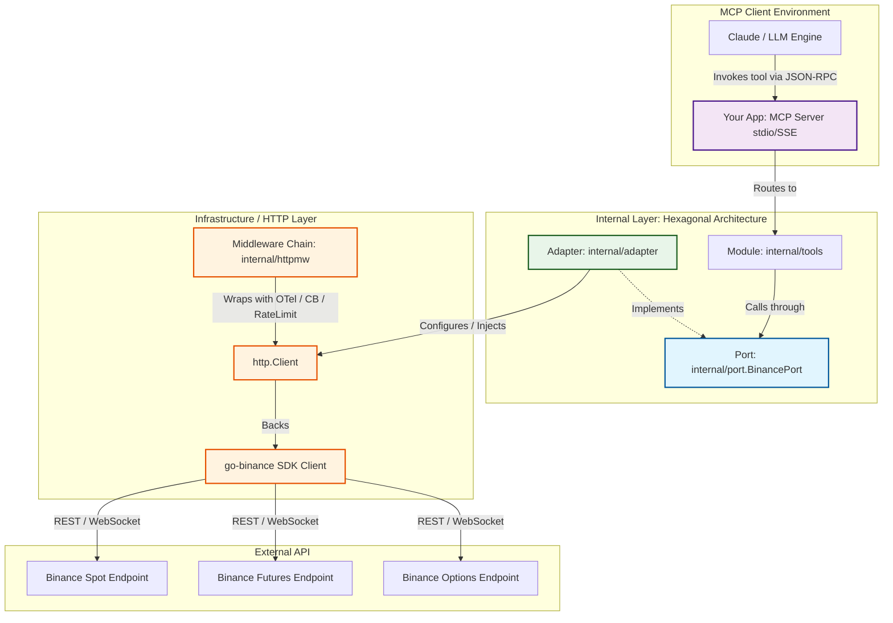

# Binance MCP Server (Golang)

[](https://golang.org)
[](https://modelcontextprotocol.io)

🇬🇧 **English** | 🇪🇸 [Español](README.es.md)

A robust, secure, and highly configurable **Model Context Protocol (MCP)** server that exposes the Binance APIs (Spot, Futures, Options) as interactive tools directly consumable by language models (LLMs) and compatible MCP clients (e.g., Claude Desktop).

Built with a **Hexagonal Architecture (Ports and Adapters)** in Go, the server implements advanced telemetry (OpenTelemetry), intelligent rate limiting, a circuit breaker, and automated retries to guarantee a premium, failure-resistant integration with Binance.

---

## 🗺️ System Architecture

The project is designed around Hexagonal Architecture principles to decouple the MCP protocol from Binance's external APIs:



For a thorough explanation of every code path and pattern used, see the [Detailed Architecture Documentation](docs/architecture_en.md).

---

## ✨ Key Features

*   **Hexagonal Clean Architecture**: Strict decoupling through the `BinancePort` interface. Easy unit testing via generated mocks.
*   **Industrial-Grade HTTP Resilience**:
    *   **Dynamic Rate Limiting**: Intercepts Binance's `X-Mbx-Used-Weight-1M` headers and preemptively pauses before hitting ban limits (HTTP 418 / 429).
    *   **Circuit Breaker**: Blocks unnecessary requests after 5 consecutive server failures using `gobreaker`.
    *   **Retry Policies**: Exponential backoff retry strategy with idempotency protection (does not retry trading requests whose bodies cannot be rewound).
    *   **Full Observability**: Trace and metrics telemetry integrated with **OpenTelemetry**, plus structured JSON logging via `slog`.
*   **Smart Position Closing**: Dynamically infers side (`BUY`/`SELL`) and mode (`Hedge` vs `One-way`) for exact position closing on Futures contracts.

---

## 🛠️ Exposed Tools (MCP Tools)

The server exposes tools grouped into the following trading areas:

| Category | Tool Name | Description |
| :--- | :--- | :--- |
| **Spot Trading** | `create_spot_order` | Places Spot orders (MARKET, LIMIT, LIMIT_MAKER). |
| **Order Management** | `cancel_order` <br> `get_open_orders` <br> `get_order_status` <br> `get_my_trades` <br> `cancel_all_orders` | Query and cancel orders individually or in bulk, plus fill history (`get_my_trades`), for Spot or Futures via the `market` parameter. |
| **Risk Control** | `create_stop_loss_order` <br> `create_take_profit_order` <br> `create_stop_limit_order` <br> `create_trailing_stop_order` <br> `create_oco_order` | Advanced stop-loss and take-profit structures with built-in validation. |
| **Market Data** | `get_ticker` <br> `get_order_book` <br> `get_klines` <br> `get_funding_rate` | Real-time market data, candlesticks, and Futures funding rate. |
| **Futures** | `create_contract_order` <br> `close_position` <br> `get_futures_positions` | Futures orders (MARKET, LIMIT, STOP_MARKET, TAKE_PROFIT_MARKET with `stopPrice`, `reduceOnly`, and `closePosition`), open positions (filterable by `symbol`), and smart position closing. |
| **Options** | `create_option_order` <br> `get_option_chain` <br> `get_option_positions` <br> `get_option_info` | Query and trade Binance European options (production only). |
| **Account** | `get_balance` <br> `get_futures_balance` <br> `get_positions` <br> `set_leverage` <br> `set_margin_mode` <br> `transfer_funds` | Manage Spot balances and the Futures wallet (USDⓈ-M), leverage, margin type (CROSSED/ISOLATED), and internal universal transfers. |
| **System** | `get_server_info` | Binance server information and current environment. |

---

## ⚙️ Configuration (Environment Variables)

The server is configured through the following environment variables:

| Variable | Type | Required | Default | Description |
| :--- | :--- | :--- | :--- | :--- |
| `BINANCE_API_KEY` | String | **Yes** | - | Binance API key for Spot and Options. |
| `BINANCE_SECRET_KEY` | String | **Yes** | - | Binance API secret matching Spot and Options. |
| `BINANCE_TESTNET` | Boolean | No | `false` | Enables Testnet for Spot and Futures. |
| `BINANCE_FUTURES_API_KEY` | String | No | *(copies `BINANCE_API_KEY`)* | Futures-specific API key (required on Testnet). |
| `BINANCE_FUTURES_SECRET_KEY`| String | No | *(copies `BINANCE_SECRET_KEY`)* | Futures-specific API secret (required on Testnet). |
| `LOG_FILE` | String | No | *(path in cache/temp dir)*| Physical location of the log and telemetry file (.log). |
| `TIMEOUT_SECONDS` | Integer | No | `30` | Maximum wait time, in seconds, for HTTP requests. |

---

## 🚀 Getting Started

### Prerequisites
*   **Go** (version 1.25+ recommended)
*   A Binance account with API keys enabled (Spot and/or Futures).

### 1. Clone and Build
```bash
git clone https://github.com/dmotta/binance-mcp-go.git
cd binance-mcp-go
go build -o binance-mcp
```

### 2. Run Locally (Manual Testing)
Set the required variables and run the binary:
```bash
export BINANCE_API_KEY="your_api_key_here"
export BINANCE_SECRET_KEY="your_secret_key_here"
export BINANCE_TESTNET="true"

./binance-mcp
```
*Note: The server starts over the StdIO protocol and listens for JSON-RPC requests from an MCP client.*

### 3. Run Unit Tests
The project includes a full unit test suite that mocks network calls and ports:
```bash
go test ./... -v
```

---

## ⚙️ MCP Client Integration

### Claude Desktop Configuration

Add the server configuration to your `claude_desktop_config.json` file (usually located at `~/Library/Application Support/Claude/claude_desktop_config.json` on macOS):

```json
{
  "mcpServers": {
    "binance-mcp": {
      "command": "/path/to/your/binance-mcp-go/binance-mcp",
      "env": {
        "BINANCE_API_KEY": "your_api_key_here",
        "BINANCE_SECRET_KEY": "your_secret_key_here",
        "BINANCE_TESTNET": "true",
        "BINANCE_FUTURES_API_KEY": "your_futures_api_key_here",
        "BINANCE_FUTURES_SECRET_KEY": "your_futures_secret_key_here"
      }
    }
  }
}
```

Once configured, restart Claude Desktop. You'll see the hammer icon indicating that the Binance tools are available to your assistant.
