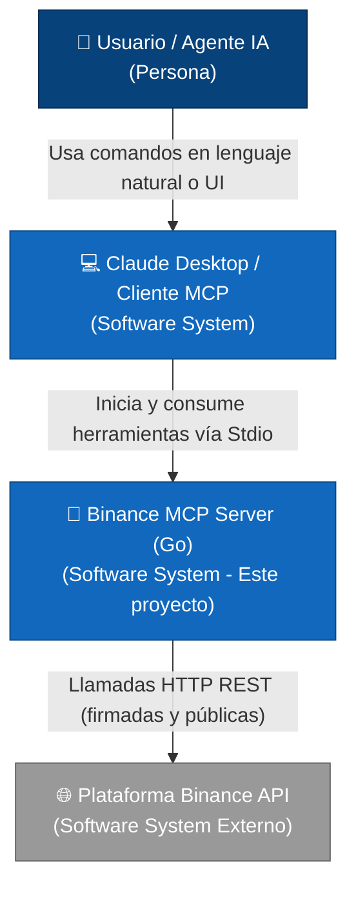
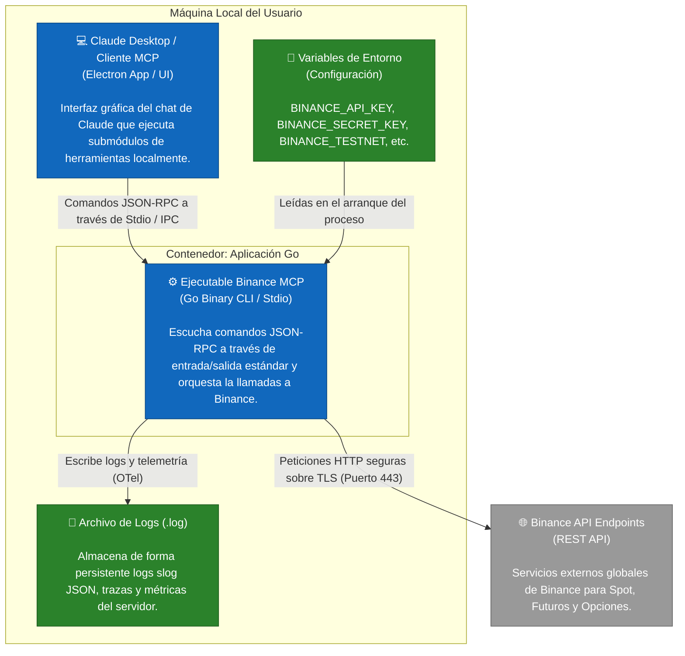
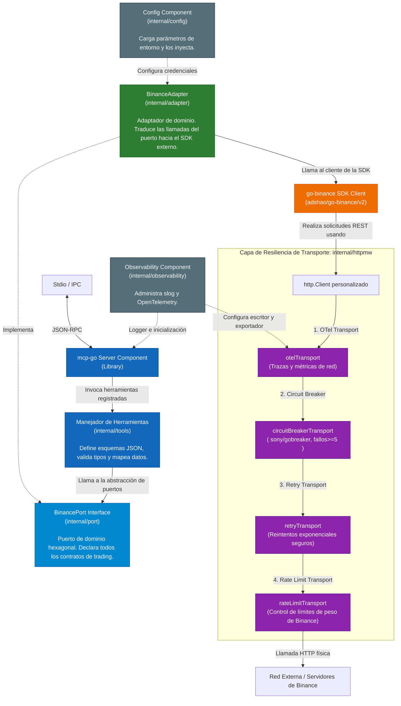
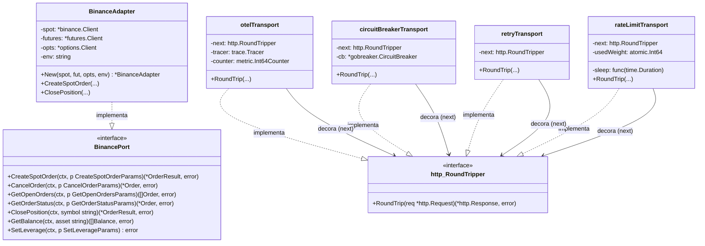

# Arquitectura y Explicación del Código Go

Este documento ofrece un desglose arquitectónico y detallado de cada módulo en **binance-mcp-go**, sirviendo como guía de referencia para comprender el diseño técnico y el funcionamiento interno del código Go.

---

## 🏛️ Diseño Arquitectónico: Arquitectura Hexagonal

El proyecto está estructurado utilizando **Arquitectura Hexagonal (o de Puertos y Adaptadores)**. Este patrón divide la aplicación en tres áreas diferenciadas:

1.  **Núcleo (Core) / Puertos (`internal/port`)**: Define las interfaces abstractas que declaran qué operaciones puede realizar la aplicación. El resto de la lógica de la aplicación (los manejadores de herramientas del servidor MCP) interactúa estrictamente con estas interfaces, sin saber qué SDK o cliente REST se utiliza por debajo.
2.  **Adaptadores (`internal/adapter`)**: Contiene las implementaciones concretas de los puertos. Aquí es donde se integra el SDK externo `github.com/adshao/go-binance/v2` para comunicarse con las APIs de Binance.
3.  **Capa de Presentación / Entrada (`internal/tools` y `main.go`)**: Recibe las invocaciones JSON-RPC del protocolo MCP, desempaqueta los parámetros y llama al puerto correspondiente.

### Ventajas de este Diseño
*   **Testabilidad**: Se puede probar la lógica de las herramientas MCP sin realizar llamadas reales de red, inyectando un mock que implemente `BinancePort` (como se observa en `internal/tools/mock_port_test.go`).
*   **Mantenibilidad**: Si la SDK de Binance cambiara o se decidiera usar llamadas REST crudas directamente, solo se tendría que actualizar el adaptador; las herramientas y la lógica del servidor MCP permanecerían intactas.

---

## 📊 Diagramas de Arquitectura (C4 Model)

Para comprender el flujo de información, la estructura de contenedores y los componentes internos del servidor, a continuación se presentan los 4 niveles de diagramas de la notación **C4 Model**.

### 🛠️ Nivel 1: Contexto del Sistema (System Context)
Este diagrama muestra cómo interactúa el usuario (o un agente autónomo de IA) con Claude Desktop, el servidor Binance MCP y la API externa de Binance.



---

### 📦 Nivel 2: Diagrama de Contenedores (Containers)
Muestra los límites físicos del despliegue del software y los archivos de configuración/logs involucrados localmente en la máquina del usuario frente a los servidores externos.



---

### 🧩 Nivel 3: Diagrama de Componentes (Components)
Desglosa los paquetes Go internos dentro del ejecutable `Binance MCP` y detalla las inyecciones de dependencias entre la capa MCP, los puertos hexagonales y la capa de transporte resiliente.



---

### 💻 Nivel 4: Diagrama de Código (Code)
Detalla la estructura e interacción de interfaces y estructuras de Go, mostrando la implementación del puerto `BinancePort` y el decorador de transporte HTTP `http.RoundTripper`.



---

## 📂 Desglose Detallado de los Módulos

### 1. Punto de Entrada (`main.go`)
El archivo [main.go](../main.go) actúa como el inicializador (orquestador) del servidor.
*   **Inicialización del Contexto**: Configura la escucha de señales del sistema (`SIGTERM`, `os.Interrupt`) a través de un contexto cancelable para asegurar un apagado ordenado.
*   **Carga de Configuración**: Carga las credenciales y configuraciones del entorno (`config.Load()`).
*   **Inicialización de Observabilidad**: Arranca OpenTelemetry y slog.
*   **Construcción del Cliente HTTP Resiliente**: Crea un cliente HTTP encadenando una serie de middlewares de transporte (disyuntor, reintentos, límites de tasa y telemetría).
*   **Instanciación de Clientes SDK de Binance**: Crea clientes separados para Spot, Futures y Options asignándoles el cliente HTTP personalizado.
*   **Inyección de Dependencias**: Instancia el adaptador `adapter.New(...)` y lo pasa a las herramientas MCP (`tools.RegisterAll(...)`).
*   **Arranque del Servidor**: Arranca el servidor MCP a través del transporte de entrada/salida estándar (StdIO).

---

### 2. Módulo de Configuración (`internal/config`)
Ubicado en [config.go](../internal/config/config.go), gestiona la lectura de variables de entorno con valores por defecto seguros:
*   `BINANCE_API_KEY` y `BINANCE_SECRET_KEY`: Requeridas obligatoriamente para inicializar la conexión.
*   `BINANCE_TESTNET`: Define si se apunta a los dominios de prueba.
*   `TIMEOUT_SECONDS`: Controla el tiempo de espera por defecto de las llamadas HTTP (30 segundos por defecto).
*   `BINANCE_FUTURES_API_KEY`: Las APIs de Futuros en Testnet a menudo requieren API Keys diferentes de Spot; este módulo lo soporta de forma nativa cayendo al API Key por defecto si no está definido.
*   `defaultLogPath()`: Localiza la carpeta de caché del sistema para guardar los logs locales (por ejemplo, en `Library/Caches/binance-mcp/` en macOS).

---

### 3. Módulo de Observabilidad (`internal/observability`)
Ubicado en [observability.go](../internal/observability/observability.go), establece una infraestructura de instrumentación unificada:
*   **JSON logging**: Configura el logger estructurado nativo de Go `slog` con salida en formato JSON en un archivo de registro exclusivo.
*   **OpenTelemetry Tracing**: Inicializa un `TracerProvider` con un batcher que exporta trazas en formato estructurado al mismo archivo de log.
*   **OpenTelemetry Metrics**: Inicializa un `MeterProvider` periódico para emitir métricas del comportamiento de llamadas de red.
*   **Función `Shutdown`**: Garantiza que todos los exportadores asíncronos de OpenTelemetry envíen sus datos acumulados antes de que la aplicación finalice.

---

### 4. Middlewares de Transporte HTTP (`internal/httpmw`)
Este módulo redefine el comportamiento de `http.RoundTripper` para interceptar cada petición HTTP saliente. Utiliza un patrón de decoración mediante la función `Chain(...)` en [chain.go](../internal/httpmw/chain.go) que crea la siguiente secuencia:

#### A. Telemetría (`otelhttp.go`)
El middleware [otelhttp.go](../internal/httpmw/otelhttp.go) abre un Span de OpenTelemetry en cada solicitud REST externa, inyectando atributos clave como `http.method`, `http.url` y registrando errores y códigos de estado en la telemetría. Además, incrementa un contador global `http.client.requests`.

#### B. Disyuntor / Circuit Breaker (`circuitbreaker.go`)
Usa `github.com/sony/gobreaker/v2` en [circuitbreaker.go](../internal/httpmw/circuitbreaker.go). Si el servidor de Binance devuelve errores HTTP >= 500 consecutivamente 5 veces, el circuito entra en estado **Abierto (Open)** y rechaza inmediatamente las peticiones futuras de forma local durante un período de enfriamiento para evitar desperdiciar hilos y mitigar la congestión del servidor remoto.

#### C. Políticas de Reintento (`retry.go`)
Implementado en [retry.go](../internal/httpmw/retry.go):
*   Realiza hasta **3 intentos** con un algoritmo de retroceso exponencial (`backoff`) con fluctuación aleatoria (`jitter`) para evitar el problema de la manada atronadora.
*   **Seguridad de Idempotencia**: Contiene una validación crítica. Si la petición tiene un cuerpo de solicitud (`req.Body`) que no se puede rebobinar (`req.GetBody == nil`), se omite el reintento. Esto previene reintentar órdenes de trading pendientes cuya re-ejecución podría duplicar una transacción de mercado.

#### D. Límite de Tasa / Rate Limiting (`ratelimit.go`)
Implementado en [ratelimit.go](../internal/httpmw/ratelimit.go):
*   Binance impone un límite de peso de solicitud de 1200 por minuto. Este middleware lee la cabecera `X-Mbx-Used-Weight-1M` devuelta en cada respuesta HTTP de Binance y actualiza un contador atómico local.
*   Si el peso acumulado cruza un **umbral de advertencia** (`weightThreshold = 1100`), el middleware bloquea automáticamente las solicitudes de forma preventiva hasta el inicio del siguiente minuto para evitar bloqueos drásticos (HTTP 429 / 418 IP ban).
*   En caso de recibir una respuesta de saturación, analiza la cabecera `Retry-After` y bloquea el hilo cliente durante el período exacto solicitado por el servidor de Binance.

---

### 5. Puerto Hexagonal (`internal/port`)
El archivo [port.go](../internal/port/port.go) define todas las estructuras de datos genéricas de dominio (e.g. `Order`, `Balance`, `Ticker`, `Kline`) y declara la interfaz `BinancePort`.

```go
type BinancePort interface {
    // Spot Trading
    CreateSpotOrder(ctx context.Context, p CreateSpotOrderParams) (*OrderResult, error)
    // Order Management
    CancelOrder(ctx context.Context, p CancelOrderParams) (*Order, error)
    // ... (rest of the API operations)
}
```

Esta interfaz unifica todas las capacidades y oculta los tipos específicos de SDK de terceros.

---

### 6. Adaptador de SDK de Binance (`internal/adapter`)
El archivo [adapter.go](../internal/adapter/adapter.go) implementa la interfaz `BinancePort`. Se encarga de traducir los parámetros genéricos a llamadas de la librería SDK `go-binance`.

#### Lógicas Críticas del Adaptador:
*   **Options Guard (`optionsGuard`)**: Binance no ofrece un entorno de pruebas público (testnet) para Opciones. El adaptador implementa un guardián que rechaza cualquier llamada a herramientas de opciones si `BINANCE_TESTNET` está activo, devolviendo un error controlado y descriptivo.
*   **Cierre de Posiciones Inteligente (`ClosePosition`)**: La API de Binance requiere conocer la dirección de cierre (`BUY` o `SELL`) y el tamaño exacto. El método `ClosePosition(symbol)` del adaptador:
    1.  Consulta las posiciones actuales de riesgo mediante `NewGetPositionRiskService()`.
    2.  Busca la posición activa y lee el signo del tamaño de la posición (`PositionAmt`). Un valor positivo representa una posición en Largo (Long); un valor negativo representa una posición en Corto (Short).
    3.  Determina la dirección contraria para cerrar la posición (e.g., si está en Long, cierra mediante una orden `SELL` de mercado).
    4.  Valida si la cuenta opera bajo **Hedge Mode** (donde se deben especificar explícitamente los lados LONG/SHORT) o **One-Way Mode** (donde se utiliza el parámetro `ReduceOnly` para garantizar la reducción estricta de la posición sin abrir una nueva de sentido contrario).

---

### 7. Capa de Herramientas MCP (`internal/tools`)
El paquete `internal/tools` expone los puntos de entrada para el servidor MCP. Se divide en archivos temáticos (e.g., [spot_trading.go](../internal/tools/spot_trading.go), [risk_control.go](../internal/tools/risk_control.go), [account.go](../internal/tools/account.go)).

Cada archivo registra sus herramientas en el servidor usando esquemas JSON estructurados y funciones controladoras:

```go
func registerCreateSpotOrder(s *server.MCPServer, b port.BinancePort) {
    t := toolWithRawSchema("create_spot_order", "Create spot market or limit orders", `{
        "type":"object",
        "required":["symbol","side","type","quantity"],
        "properties":{
            "symbol":   {"type":"string"},
            "side":     {"type":"string","enum":["BUY","SELL"]},
            "type":     {"type":"string","enum":["MARKET","LIMIT","LIMIT_MAKER"]},
            "quantity": {"type":"number"},
            "price":    {"type":"number"}
        }
    }`)
    s.AddTool(t, func(ctx context.Context, req mcp.CallToolRequest) (*mcp.CallToolResult, error) {
        // ... extracción de parámetros ...
        res, err := b.CreateSpotOrder(ctx, params)
        if err != nil {
            return resultErr("create_spot_order failed: %v", err)
        }
        return resultJSON(res)
    })
}
```

#### Detalles de Implementación de Herramientas:
*   **Manejo de Tipos**: Las APIs JSON-RPC del cliente transmiten números flotantes para cantidades y precios. Las herramientas realizan la conversión y redondeo necesario a Strings de punto flotante formateado (`%g`), que es el formato que requiere Binance.
*   **Validaciones en Trailing Stops**: Valida en la herramienta `create_trailing_stop_order` que el ratio `callbackRate` esté en formato de porcentaje directo (entre `0.1` y `20` por ciento). Internamente, el puerto multiplica este valor por 100 para convertirlo a BIPS (unidades de punto básico, de 10 a 2000), tal y como lo requiere la API oficial de Binance.
