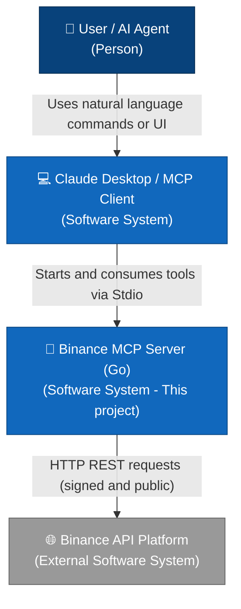
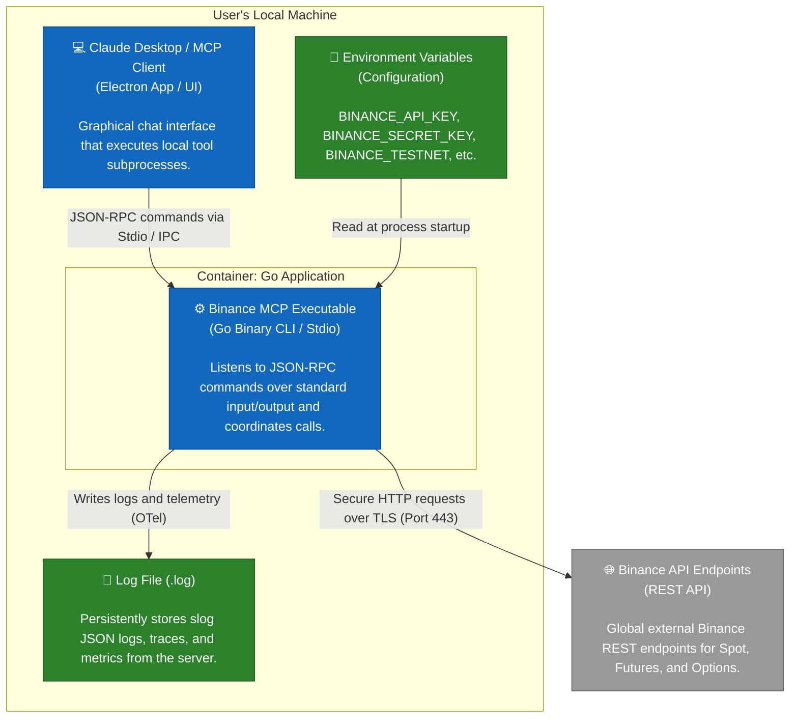
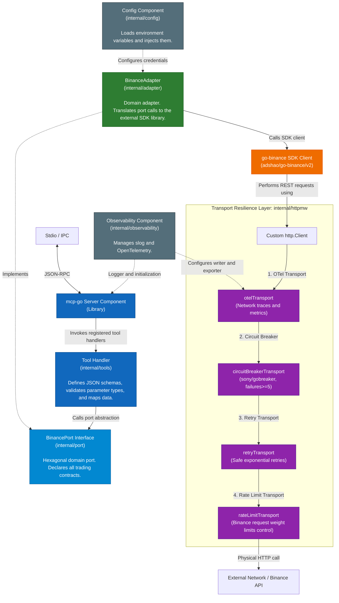
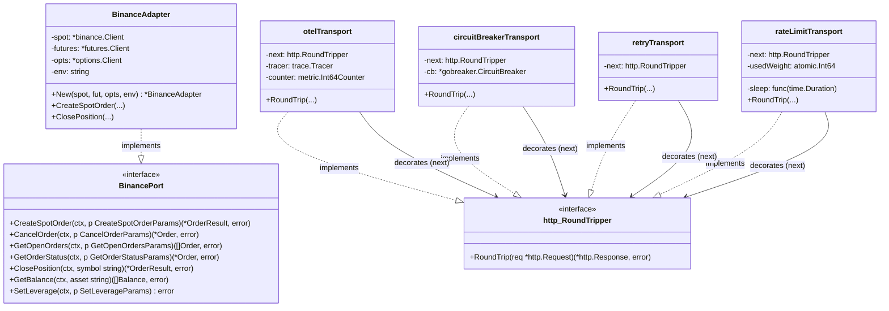

# Architecture & Go Code Explanation

This document provides a comprehensive architectural breakdown and detailed explanation of each module within **binance-mcp-go**, serving as a reference guide to understand the system design and the internal mechanics of the Go codebase.

---

## 🏛️ Architectural Design: Hexagonal Architecture

The project is structured around the principles of **Hexagonal Architecture (also known as Ports & Adapters)**. This pattern divides the application into three distinct layers:

1.  **Core / Ports (`internal/port`)**: Declares abstract interfaces representing what operations the system can perform. The rest of the application (e.g. MCP tool handlers) depends strictly on these interfaces, remaining completely decoupled from third-party SDKs or direct HTTP clients.
2.  **Adapters (`internal/adapter`)**: Contains concrete implementations of the ports. This is where the external SDK `github.com/adshao/go-binance/v2` is integrated to interact with Binance's API endpoints.
3.  **Presentation / Driving Layer (`internal/tools` & `main.go`)**: Receives JSON-RPC requests from the MCP client, unpacks parameters, calls the appropriate port method, and formats the output.

### Benefits of this Pattern
*   **Testability**: MCP tool logic can be fully tested without hitting actual network endpoints by injecting a mock implementing `BinancePort` (as demonstrated in `internal/tools/mock_port_test.go`).
*   **Maintainability**: If the Binance SDK were to change or be replaced with raw HTTP calls, only the adapter package needs modification; the MCP tools and general server orchestration remain untouched.

---

## 📊 Architecture Diagrams (C4 Model)

To illustrate the data flows, container divisions, and internal Go package components, the 4 levels of the **C4 Model** are presented below.

### 🛠️ Level 1: System Context
Shows how a user (or an autonomous AI agent) interacts with Claude Desktop, the Binance MCP server, and the external Binance API.

---

### 📦 Level 2: Containers
Illustrates the physical boundaries of the deployment, showing local configuration and logs on the user's machine relative to the remote servers.

---

### 🧩 Level 3: Components
Deconstructs the internal packages inside the `Binance MCP` Go executable and details how dependencies are wired between the MCP layer, the hexagonal ports, and the resilient transport layer.

---

### 💻 Level 4: Code
Shows the structural relationship between Go types, detailing the implementation of `BinancePort` and the chain of custom `http.RoundTripper` decorator implementations.

---

## 📂 Detailed Module Breakdown

### 1. Entry Point (`main.go`)
[main.go](../main.go) orchestrates the application startup:
*   **Context Setup**: Sets up signal listening (`SIGTERM`, `os.Interrupt`) using a cancelable context to ensure clean shutdowns.
*   **Config Loading**: Loads variables from the environment (`config.Load()`).
*   **Observability Startup**: Initializes slog logging and OpenTelemetry.
*   **Resilient HTTP Transport Chain**: Instantiates custom middlewares for OTel, Circuit Breakers, Retries, and Rate Limits.
*   **Binance SDK Client Setup**: Instantiates separate SDK clients for Spot, Futures, and Options, injecting the resilient HTTP client.
*   **Dependency Injection**: Instantiates the adapter (`adapter.New(...)`) and registers all JSON-RPC tools (`tools.RegisterAll(...)`).
*   **Server Run**: Starts the MCP server on Stdio.

---

### 2. Configuration (`internal/config`)
Defined in [config.go](../internal/config/config.go), this package reads configuration parameters from environment variables:
*   `BINANCE_API_KEY` and `BINANCE_SECRET_KEY`: Required credentials.
*   `BINANCE_TESTNET`: Specifies whether the server directs requests to the Binance Testnet domains.
*   `TIMEOUT_SECONDS`: Maximum HTTP request wait time (defaults to 30 seconds).
*   `BINANCE_FUTURES_API_KEY` and `BINANCE_FUTURES_SECRET_KEY`: In Testnet, Futures API keys are distinct from Spot. These fall back to the Spot keys if not provided.
*   `defaultLogPath()`: Places the logs directory inside the operating system's local user cache (e.g. `Library/Caches/binance-mcp/` on macOS).

---

### 3. Observability (`internal/observability`)
Defined in [observability.go](../internal/observability/observability.go), this module configures local telemetry:
*   **JSON logging**: Creates a structured log engine using `slog` outputting JSON directly to the log file.
*   **OpenTelemetry Tracing**: Sets up a tracer writing spans to the log file in JSON.
*   **OpenTelemetry Metrics**: Registers periodic readers to emit network metrics.
*   **Shutdown Handler**: Flushes OpenTelemetry buffers to prevent losing traces during a shutdown.

---

### 4. HTTP Transport Middlewares (`internal/httpmw`)
Middlewares intercept outgoing HTTP calls by wrapping `http.RoundTripper` in a decorator pattern. The chain is constructed in [chain.go](../internal/httpmw/chain.go) as follows:

#### A. Telemetry (`otelhttp.go`)
[otelhttp.go](../internal/httpmw/otelhttp.go) intercepts outgoing requests to record HTTP methods, URL paths, and status codes. It increments the `http.client.requests` counter and tags errors on failed network requests.

#### B. Circuit Breaker (`circuitbreaker.go`)
Uses `github.com/sony/gobreaker/v2` in [circuitbreaker.go](../internal/httpmw/circuitbreaker.go). If the Binance API returns 5xx status codes (or transport failures) 5 consecutive times, the breaker trips to **Open**, preventing additional network calls locally during a cool-down period.

#### C. Exponential Retries (`retry.go`)
Defined in [retry.go](../internal/httpmw/retry.go):
*   Attempts requests up to **3 times** with exponential backoff and randomized jitter to prevent thundering herd conditions.
*   **Idempotency Safety**: Verifies if the request body is rewindable (`req.GetBody != nil`). If a request body cannot be rewound (e.g., streaming payloads), the retry is aborted. This prevents duplicate executions on orders, protecting the wallet against unintended duplicate trades.

#### D. Rate Limiting (`ratelimit.go`)
Defined in [ratelimit.go](../internal/httpmw/ratelimit.go):
*   Binance enforces a request weight limit of 1200 per minute. This middleware reads the `X-Mbx-Used-Weight-1M` header from responses to track used weight.
*   If used weight crosses the warning threshold (`weightThreshold = 1100`), the middleware blocks new requests until the next minute boundary to avoid receiving IP bans (HTTP 418/429).
*   If an HTTP 429/418 is received, it parses the `Retry-After` header and sleeps for the requested duration.

---

### 5. Hexagonal Port (`internal/port`)
Declared in [port.go](../internal/port/port.go), `BinancePort` is the interface isolating core domain models (`Order`, `Balance`, `Ticker`, `Kline`) from the specific API implementation details.

---

### 6. Binance SDK Adapter (`internal/adapter`)
Written in [adapter.go](../internal/adapter/adapter.go), `BinanceAdapter` implements `BinancePort` by calling the `go-binance` library:
*   **Options Guard (`optionsGuard`)**: Since Binance does not offer a public Options testnet, this helper returns an error if options tools are triggered in testnet mode.
*   **Position Closing Logic (`ClosePosition`)**: Close actions require calculating exact opposite sides and checking position settings:
    1.  Queries active positions via `NewGetPositionRiskService()`.
    2.  Resolves the direction from the signed position size (`PositionAmt`). A positive number represents a Long, while a negative number indicates a Short.
    3.  Determines the closing order side (e.g., if Long, the closing order is a `SELL` market order).
    4.  Inspects if the account is in **Hedge Mode** (requiring explicit LONG/SHORT position side flags) or **One-Way Mode** (requiring the `ReduceOnly` flag to ensure the position is reduced without flipping into a counter-position).

---

### 7. MCP Tools Layer (`internal/tools`)
The `internal/tools` package registers JSON-RPC tool endpoints with the MCP server (e.g., [spot_trading.go](../internal/tools/spot_trading.go), [risk_control.go](../internal/tools/risk_control.go), [account.go](../internal/tools/account.go)).

*   **Schema Registration**: Calls `toolWithRawSchema` to register raw JSON schemas.
*   **Type Conversions**: Tool arguments are parsed from JSON values. Quantities and prices are parsed, validated, and formatted into strings (`%g`) to feed the SDK.
*   **Trailing Stop Handling**: The `create_trailing_stop_order` tool accepts `callbackRate` in percent (e.g. `1.5` for 1.5%), validating it is in the range `0.1-20`. The adapter automatically converts this to basis points (BIPS) (e.g. `150`) as required by the Binance API.
